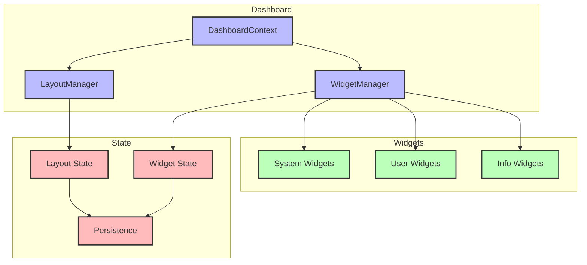
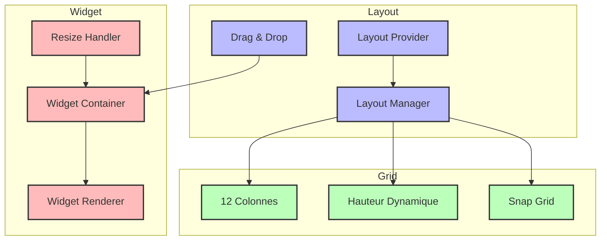

# Dashboard Modulaire

> Navigation rapide :
>
> - [Brief du Projet](../projet.md)
> - [Liste des Besoins](../besoins.md)
> - [Documentation Technique](../../docs-structure.md)
>
> Composants liés :
>
> - [Système de Thèmes](../themes/themes.md) (styles)
> - [Panels](../panels/panels.md) (intégration)
> - [Outils](../outils/outils.md) (widgets système)

## Description

Le dashboard de DISPO est un système modulaire permettant l'organisation et la personnalisation flexible des composants d'interface utilisateur, intégré avec le [système de thèmes](../themes/themes.md) et les [panels système](../panels/panels.md).

## Architecture

### Diagramme du Système Dashboard



### Grille et Layout



### Structure de Base

```typescript
interface DashboardProps {
  layout: LayoutConfig;
  components: DashboardComponent[];
  onLayoutChange?: (newLayout: LayoutConfig) => void;
}

interface DashboardComponent {
  id: string;
  type: ComponentType;
  config: ComponentConfig;
  position: GridPosition;
}

interface GridPosition {
  x: number;
  y: number;
  w: number;
  h: number;
}
```

### Système de Grille

- Grille responsive 12 colonnes
- Hauteur dynamique
- Snap-to-grid
- Gestion des collisions

## Composants

### Types de Composants

1. Widgets Système

   - Moniteur de ressources → [Voir Outils Système](../outils/outils.md#outils-système)
   - Notifications → [Voir Système de Notifications](../outils/outils.md#système-de-notifications)
   - Statut système

2. Widgets Utilisateur

   - Notes rapides
   - Liens favoris
   - Tableaux de bord personnalisés

3. Widgets d'Information
   - Graphiques
   - Statistiques
   - Flux d'activité

### Gestion des États

- Context React pour l'état global
- État local par widget
- Persistance des configurations

## Interactions

### Manipulation

- Drag and drop intuitif
- Redimensionnement fluide
- Menu contextuel
- Raccourcis clavier

### Personnalisation

- Configuration par widget
- Sauvegarde des layouts
- Préréglages d'affichage
- Thèmes par widget

## Implémentation

### Hooks Personnalisés

```typescript
const { addWidget, removeWidget, updateWidget } = useDashboard();
const { layout, updateLayout } = useLayout();
```

### Gestion des Données

- Chargement asynchrone
- Mise en cache
- Actualisation automatique
- Gestion des erreurs

### Optimisation

- Code splitting par widget
- Chargement différé
- Memoization des rendus
- Virtualisation si nécessaire

## Styles

### Thème

- Intégration avec le système de thèmes
- Variables CSS spécifiques
- Transitions fluides

### Responsive

- Breakpoints configurables
- Layouts adaptatifs
- Mode mobile optimisé

## Bonnes Pratiques

### Performance

- Lazy loading des widgets
- Optimisation des re-rendus
- Gestion efficace de la mémoire

### Accessibilité

- Navigation au clavier
- ARIA labels
- Focus management
- Messages d'état

### Maintenance

- Tests unitaires
- Documentation des widgets
- Standards de développement
- Processus de mise à jour
