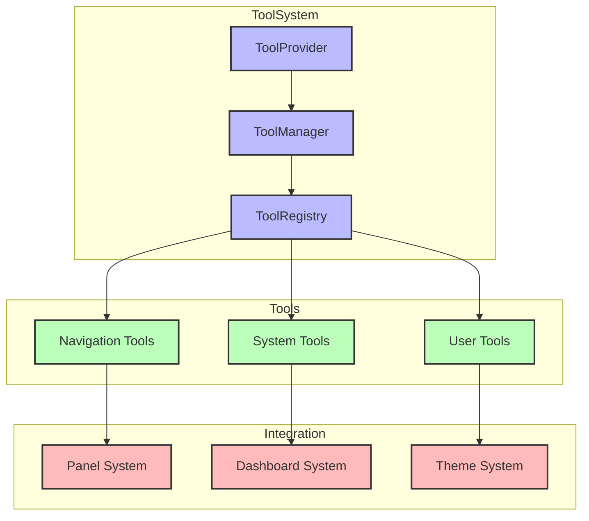
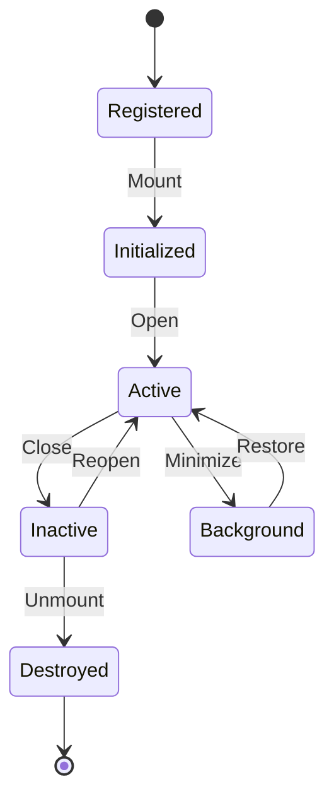
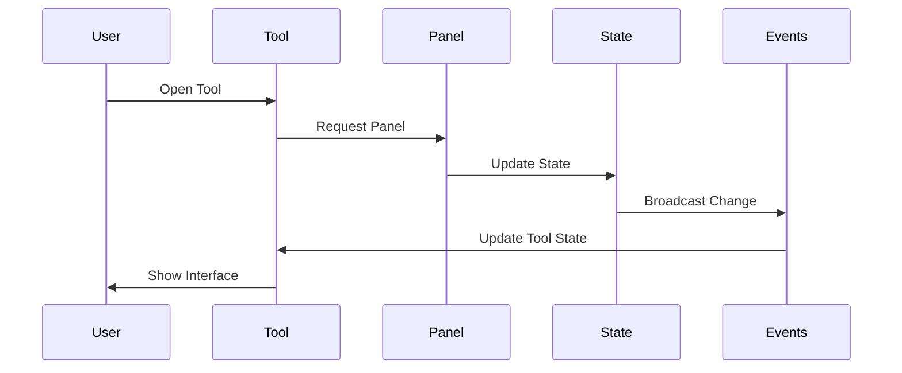

# Outils Système

> Navigation rapide :
>
> - [Brief du Projet](../projet.md)
> - [Liste des Besoins](../besoins.md)
> - [Documentation Technique](../../docs-structure.md)
>
> Composants liés :
>
> - [Panels](../panels/panels.md) (intégration)
> - [Dashboard](../dashboard/dashboard.md) (widgets)
> - [Thèmes](../themes/themes.md) (gestionnaire)

## Description

Les outils système de DISPO sont un ensemble de mini-applications intégrées dans le [panel supérieur](../panels/panels.md), offrant des fonctionnalités rapides et essentielles.

## Architecture

### Diagramme du Système d'Outils



### Cycle de Vie d'un Outil



### Flux de Communication



### Structure de Base

```typescript
interface SystemToolProps {
  id: string;
  icon: IconComponent;
  label: string;
  onClick?: () => void;
  panel?: React.ReactNode;
  shortcut?: string;
}

interface ToolPanelProps {
  isOpen: boolean;
  onClose: () => void;
  position: "top" | "right";
  children: React.ReactNode;
}
```

## Types d'Outils

### 1. Outils de Navigation

- Recherche rapide
- Navigation par dossiers
- Historique récent
- Favoris

### 2. Outils Système

- Gestionnaire de thèmes → [Voir Système de Thèmes](../themes/themes.md)
- Moniteur de performances
- Gestionnaire de notifications
- Paramètres système

### 3. Outils Utilisateur

- Notes rapides → [Voir Widgets Dashboard](../dashboard/dashboard.md#types-de-composants)
- Calculatrice
- Horloge/Timer
- Todo list

## Implémentation

### Gestion des États

```typescript
interface ToolState {
  isOpen: boolean;
  position: PanelPosition;
  data: any;
}

const { openTool, closeTool, toggleTool } = useSystemTools();
```

### Événements

- Click/Touch
- Raccourcis clavier
- Drag and drop
- Interactions contextuelles

### Persistance

- État des outils
- Préférences utilisateur
- Données locales
- Synchronisation

## Interface Utilisateur

### Barre d'Outils

- Icônes claires
- Tooltips informatifs
- Indicateurs d'état
- Animations fluides

### Panels

- Ouverture/fermeture fluide
- Redimensionnement possible
- Position configurable
- Thème cohérent

### Interactions

- Drag and drop
- Redimensionnement
- Minimisation/Maximisation
- Raccourcis clavier

## Fonctionnalités

### Système de Notifications

- Notifications temps réel
- Priorités configurables
- Groupement intelligent
- Actions rapides

### Recherche Globale

- Recherche instantanée
- Filtres avancés
- Historique
- Suggestions

### Gestionnaire de Thèmes

- Prévisualisation en direct
- Import/Export
- Personnalisation
- Préréglages

## Bonnes Pratiques

### Performance

- Chargement à la demande
- Optimisation des ressources
- Cache intelligent
- Nettoyage automatique

### Accessibilité

- Navigation clavier
- Support lecteur d'écran
- Contraste suffisant
- Messages d'état clairs

### Maintenance

- Tests automatisés
- Documentation claire
- Versioning des outils
- Mises à jour simples

## Développement

### Création d'Outils

```typescript
const newTool = createSystemTool({
  id: "my-tool",
  icon: MyToolIcon,
  label: "Mon Outil",
  panel: MyToolPanel,
  shortcut: "Alt+T",
});
```

### Extension

- API publique
- Système de plugins
- Hooks personnalisés
- Documentation développeur
