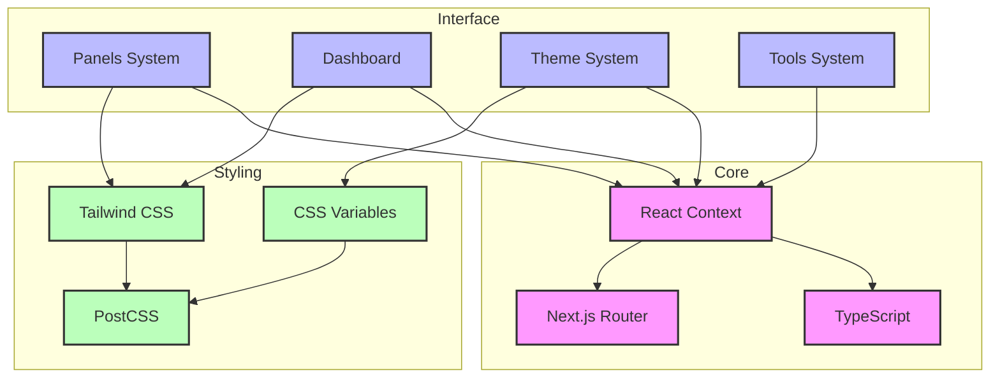
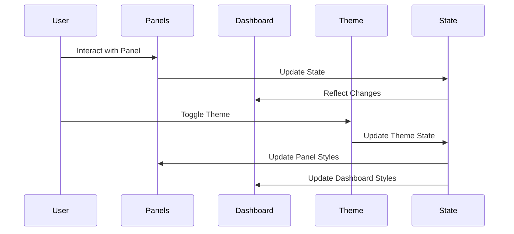

# DISPO - Brief du Projet

> Navigation rapide :
>
> - [Liste des Besoins](./besoins.md)
> - [Système de Panels](./panels/panels.md)
> - [Système de Thèmes](./themes/themes.md)
> - [Dashboard Modulaire](./dashboard/dashboard.md)
> - [Outils Système](./outils/outils.md)
> - [Structure de la Documentation](../docs-structure.md)

## Vue d'Ensemble

DISPO est une application web moderne construite avec Next.js 15 et React 19, conçue pour offrir une interface utilisateur flexible et modulaire. Le projet met l'accent sur une expérience utilisateur fluide avec un système de thèmes dynamique et une architecture de composants évolutive.

## Architecture du Système

## Flux de Données

## Caractéristiques Principales

### Interface Modulaire

- Dashboard personnalisable avec composants modulaires
- Système de panels coulissants dans quatre directions (haut, bas, gauche, droite)
- Interface adaptative avec support des thèmes clair/sombre

### Architecture Technique

- Base Next.js 15+ avec App Router pour un routage optimisé
- Support TypeScript complet pour une meilleure maintenabilité
- Système CSS moderne avec Tailwind et PostCSS
- Gestion avancée des thèmes via variables CSS

### Expérience Utilisateur

- Design réactif et adaptatif
- Transitions fluides entre les états
- Support du mode sombre natif
- Interface utilisateur cohérente et intuitive

## Vision du Projet

DISPO vise à fournir une plateforme flexible et extensible pour la création d'interfaces utilisateur modulaires. L'accent est mis sur :

- La modularité et la réutilisabilité des composants
- La performance et l'optimisation
- L'expérience utilisateur fluide
- La maintenabilité du code

## Objectifs Techniques

1. Maintenir une base de code TypeScript stricte
2. Assurer une hydratation React sans faille
3. Optimiser les performances CSS
4. Faciliter l'extension du système de thèmes
5. Garantir une documentation complète
