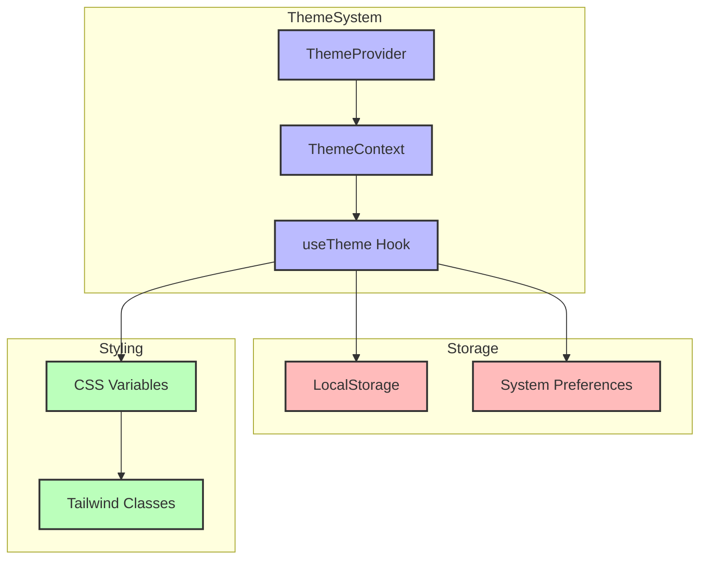
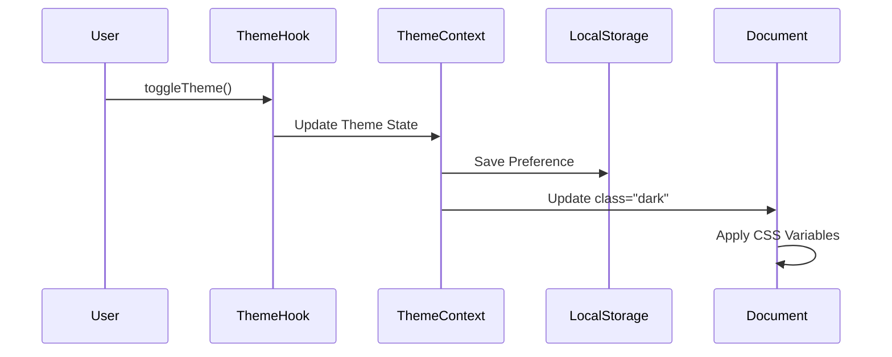

# Système de Thèmes

> Navigation rapide :
>
> - [Brief du Projet](../projet.md)
> - [Liste des Besoins](../besoins.md)
> - [Documentation Technique](../../docs-structure.md)
>
> Composants liés :
>
> - [Dashboard](../dashboard/dashboard.md#thème) (intégration)
> - [Panels](../panels/panels.md#styles) (styles)
> - [Outils](../outils/outils.md#gestionnaire-de-thèmes) (gestionnaire)

## Description

Le système de thèmes de DISPO offre une gestion avancée des styles visuels avec support natif du mode sombre et des thèmes personnalisables via des variables CSS.

## Architecture

### Diagramme du Système de Thèmes



### Flux de Changement de Thème



### Structure des Variables CSS

```css
:root {
  /* Couleurs Système */
  --background: #ffffff;
  --foreground: #000000;

  /* Couleurs Panels */
  --panel-bg-color: #f8f8f8;
  --panel-text-color: #2d2d2d;
  --panel-hover-color: #e8e8e8;

  /* Couleurs Blocs */
  --block-bg-color: #ffffff;

  /* Couleurs Thème */
  --text-primary: #2d2d2d;
  --text-secondary: #666666;
  --accent-color: #0066cc;
  --alt-accent-color: #3399ff;
  --border-color: #e0e0e0;
  --card-bg: #ffffff;

  /* Typographie */
  --h1-color: #1a1a1a;
  --h2-color: #333333;
  --h3-color: #4d4d4d;
  --p-color: #666666;
  --span-color: #808080;
}

.dark {
  /* Version sombre des variables */
}
```

## Implémentation

### Composants React

```typescript
interface ThemeProviderProps {
  children: React.ReactNode;
  defaultTheme?: "light" | "dark";
}

interface UseThemeResult {
  theme: "light" | "dark";
  toggleTheme: () => void;
  setTheme: (theme: "light" | "dark") => void;
}
```

### Gestion de l'État

- Context React pour l'état global du thème
- LocalStorage pour la persistance
- Synchronisation avec les préférences système
- Intégration avec le [Dashboard](../dashboard/dashboard.md) et les [Panels](../panels/panels.md)

### Préréglages

- Thèmes par défaut (clair/sombre)
- Thèmes personnalisés
- Import/Export de thèmes

## Utilisation

### Hook Personnalisé

```typescript
const { theme, toggleTheme, setTheme } = useTheme();
```

### Classes Utilitaires

```typescript
const themeClasses = {
  primary: "text-theme-primary",
  secondary: "text-theme-secondary",
  accent: "text-theme-accent",
  // ...
};
```

### Transitions

- Animations fluides entre les thèmes
- Durée configurable
- Support de prefers-reduced-motion

## Personnalisation

### API de Thème

- Modification des variables CSS
- Création de nouveaux thèmes
- Extension des thèmes existants
- Interface avec le [Gestionnaire de Thèmes](../outils/outils.md#gestionnaire-de-thèmes)

### Validation

- Contraste minimum garanti
- Vérification d'accessibilité
- Tests de lisibilité

### Persistance

- Sauvegarde locale des préférences
- Synchronisation multi-onglets
- Restauration des paramètres

## Bonnes Pratiques

### Performance

- Minimisation des calculs CSS
- Optimisation des transitions
- Chargement conditionnel des thèmes

### Accessibilité

- Respect des contrastes WCAG
- Support des préférences système
- Messages d'état clairs

### Maintenance

- Documentation des variables
- Tests automatisés
- Processus de mise à jour
